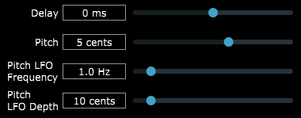

## Chorus Plugin
A chorus effect VST project that builds a working `.vst3` file for use with most digital audio workstations. It was developed using the JUCE C++ framework and processes audio in real-time.

[Video Demonstration](https://youtu.be/j42mkOdNKBg)



The effect is achieved using a circular buffer for delay, and an LFO for pitch modulation.

## Installing Rubber Band
This project requires the rubberband pitch-shifting library to be built locally and linked to the project. The steps are as follows:
1. Clone the rubberband repo. Assuming this is cloned to `C:\Downloads`
```
git@github.com:breakfastquay/rubberband.git
```
2. We now need to build the rubberband library. The repo recommends installing meson and ninja, which I do not want to do, so follow these steps for building with VS
3. In VS, open solution (Ctrl-Shift-O), then open `C:\Downloads\rubberband\otherbuilds\rubberband-library.vcxproj`
4. By default, rubberband will compile in x86, to set to x64, open Build > Configuration Manager
5. Change all the x86 to x64 (there should be 2 dropdowns to change)
6. In VS Solution Explorer, right click `rubberband-library` and press build
7. Verify that library files are now at `C:\Downloads\rubberband\otherbuilds\Debug`
8. Add the rubberband library to Projucer > Project > Visual Studio 2019 > External Libraries to Link
  `rubberband-library.lib`
  This actually links the rubberband library to the plugin when it compiles.
9. Add the rubberband library path to Projucer > Project > Visual Studio 2019 > Debug > Extra Library Search Paths
  `C:\Downloads\rubberband\otherbuilds\Debug`
  This specifies the path of the library file
10. Add the rubberband header path to Projucer > Project > Visual Studio 2019 > Debug > Header Search Paths
  `C:\Downloads\rubberband`
  This step allows VS to understand the header definitions for rubberband
11. Re-launch the Visual Studio project from Projucer. 

**Note:** for release builds, repeat steps 6, 9, and 10 but with the release build target
